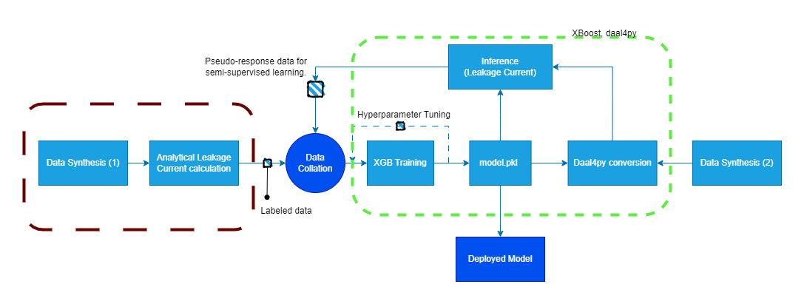
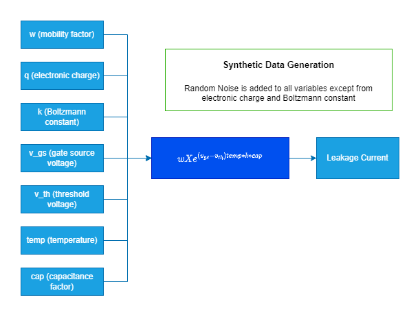
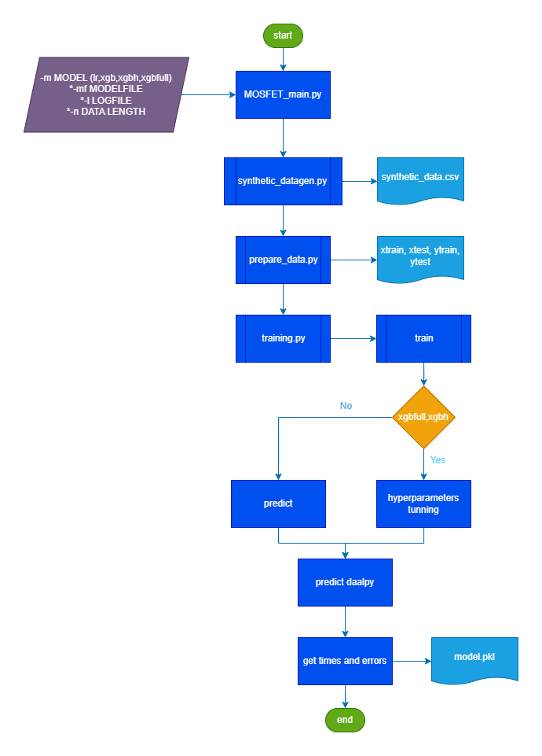

# **Digital Twin**

## Introduction

This case uses Intel® Optimized version of XGBoost* to achieve fast traing and inference times, converts a gradient boosting model to a daal4py version included inside Intel® Extension for Scikit-Learn* and enable inference performance acceleartion.
With this use case you will learn to use Intel® tools to build a Digital Twin model which reflects the response (leakage current) of a Metal-Oxide Substrate Field Effect Transistors (MOSFETs) based on the voltage received (gate) for design exploration purposes helping saving cost compared with normal physical experimentation. Visit [Developer Catalog](https://developer.intel.com/aireferenceimplementations) for more workflow examples. 


<!--is this hidden?-->
## **Contents**

- [**Building a MOSFET Digital Twin for Design Exploration: Modeling Sub-threshold Voltage Leakage Current using XGBoostRegressor**](#building-a-mosfet-digital-twin-for-design-exploration-modeling-sub-threshold-voltage-leakage-current-using-xgboostregressor)
  - [Introduction](#introduction)
  - [**Contents**](#contents)
  - [Solution Technical Overview](#solution-technical-overview)
  - [Solution Technical Details](#solution-technical-details)
    - [Task 1: Generate Synthetic Data](#task-1-generate-synthetic-data)
    - [Task 2: Training](#task-2-training)
    - [Task 3: Tuning](#task-3-tuning)
    - [Task 4: Semi-supervised Learning](#task-4-semi-supervised-learning)
    - [Task 5: Prediction](#task-5-prediction)
  - [Validated Hardware Details](#validated-hardware-details)
  - [How it works](#how-it-works)
  - [Get Started](#get-started)
    - [Environment variables](#environment-variables)
    - [Download the Workflow Repository](#download-the-workflow-repository)
    - [Set Up Conda](#set-up-conda)
    - [Set Up Environment](#set-up-environment)
  - [Supported Runtime Environment](#supported-runtime-environment)
  - [Run using Bare Metal](#run-using-bare-metal)
    - [Clean Up Bare Metal](#clean-up-bare-metal)
  - [Expected output](#expected-output)
  - [Summary and next steps](#summary-and-next-steps)
    - [How to customize this use case](#how-to-customize-this-use-case)
    - [Adopt to your dataset](#adopt-to-your-dataset)
  - [Learn More](#learn-more)
  - [Support](#support)
  - [Appendix](#appendix)
    - [About This Use Case](#about-this-use-case)
    - [References](#references)


## Solution Technical Overview

A Digital Twin ([1],[2]) is a virtual model designed to accurately reflect a physical object behaviour during its lifecycle, it can be updated with real-time data, machine learning and simulation. For the creation of a Digital Twin the object in question is outfitted with various sensors located in vital areas of functionality, this areas are defined according to the impact the information has with the desired output of the studied object. 
Examples of data produced by the sensors are temperature, humidity, pressure, distance, voltage, current, resistance, etc. 
Once the data is studied and analyzed, it can fed a virtual model to run simulations, study critical behaviours, experimental optimizitations and provide valuable insights to be applied to the original physical object from response to the input variables or conditions.
This mere definition of a Digital Twin has impact in many areas of study for different types of industries due to the low cost compared with having a real physical twin object to perform tests which may cause the object to stop working or even cause catasthropic reactions. Digital Twins can also predict the lifespan of the object under certain conditions with predictive analytics, support the maintanance methods for it and manage complex connections within systems of systems. 


For this reference kit we have chosen to model the behavior of Metal-Oxide Substrate Field Effect Transistors (MOSFETs), which are commonly used in consumer electronics and power devices. For MOSFETs the "leakage current" is a key indicator of performance. Hence understanding how the leakage current varies as a function of the input conditions is critical. 

The device includes three components (source, drain and gate). The source-drain current is a function of the operating gate voltage, $v_{gs}$ and the threshold voltage $v_{th}$. The ideal switching characteristic of MOSFET is such that if the gate-source voltage exceeds the specified threshold voltage, the MOSFET is in the ON state. Otherwise, the device is in the OFF state, and the source drain current should be zero. However, in real applications there is always a leakage current because of several factors. The leakage current can be estimated through analytical equations which do not take into account statistical noise or testing which is often expensive. 

A Machine Learning (ML) solution or an ML-powered MOSFET Digital Twin can be a valuable substitute which will predict leakage current from input values which include $v_{th}$ and $v_{gs}$. Initial $v_{gs}$ and $v_{th}$ and **leakage_current** data can be collected on millions of MOSFETs. An ML model can be built using this data and can be continuously updated as more data is populated. Essentially this "model" can serve as a digital twin and substitute expensive testing/experimentation. Calculating the sub-threshold leakage of multiple MOSFETs for several voltage levels can help optimize manufacturing as well as monitor performance in the field.

In addition, this use case uses Intel® tools to speed the whole pipeline, which will be briefly described below, if you want to go directly to the links for each one of the Intel® tools described go to [Learn More](#learn-more) section. 
  
Scikit-learn* (often referred to as sklearn) is a Python* module for machine learning. Intel® Extension for Scikit-learn* seamlessly speeds up your scikit-learn applications for  Intel® CPUs and GPUs across single- and multi-node configurations. This extension package dynamically patches scikit-learn estimators while improving performance for your machine learning algorithms.

The extension is part of the Intel® AI Analytics Toolkit (AI Kit) that provides flexibility to use machine learning tools with your existing AI packages.

XGBoost* is an open source gradient boosting machine learning library. It performs well across a variety of data and problem types, so it often pushes the limits of compute resources.
Using  XGBoost* on  Intel® CPUs takes advantage of software accelerations powered by oneAPI, without requiring any code changes. Software optimizations deliver the maximum performance for your existing hardware. This enables faster iterations during development and training, and lower latency during inference.. **Please keep in mind** that to train an  XGBoost* model using  Intel® optimizations, the 'tree_method' parameter should be set to 'hist'. 

Modin* is a drop-in replacement for pandas, enabling data scientists to scale to distributed DataFrame processing without having to change API code. Intel® Distribution of Modin* adds optimizations to further accelerate processing on Intel® hardware.

daal4py included in Intel® oneAPI Data Analytics Library (oneDAL)* as part of the Intel® Extension for Scikit-learn*, is an easy-to-use Python* API  that provides superior performance for your machine learning algorithms and frameworks. Designed for data scientists, it provides a simple way to utilize powerful Intel® DAAL machine learning algorithms in a flexible and customizable manner. For scaling capabilities, daal4py also provides you the option to process and analyze data via batch, streaming, or distributed processing modes, allowing you to choose the option to best fit your system's needs.

For more details, visit the [Building a MOSFET Digital Twin for Design Exploration: Modeling Sub-threshold Voltage Leakage Current using XGBoostRegressor](https://github.com/oneapi-src/digital-twin) GitHub repository.

## Solution Technical Details

A schematic of the proposed reference architecture is shown in the following figure. The portion of the diagram enclosed in the red dashed line is the section of the workload for generating the synthetic data. The dashed green line section corresponds to the XGBoost* optimization process.

daal4py's speedy frameworks are best known as a way to accelerate machine learning algorithms from Scikit-Learn*, however, this guide provides you with the information to use the daal4py algorithms directly.



### Task 1: Generate Synthetic Data
The main data generator script is located in (src/utils/synthetic_datagen.py)
The following figure describes how the leakage current is calculated from voltage values and other parameters.



### Task 2: Training

The proposed reference solution is built primarily using an  XGBoost*   Regressor. However, separate experiments were conducted using a Linear Regressor to serve as a reference point for Mean Squared Error (MSE) values and confirm that  XGBoost* outperforms a simple Linear Regressor.

### Task 3: Tuning
The Hyperparameter tunning happens during the training phase by getting the best parameters and best estimator from the [GridSearchCV](https://scikit-learn.org/stable/modules/generated/sklearn.model_selection.GridSearchCV.html) function from [Intel® Extension for Scikit-learn*](https://www.intel.com/content/www/us/en/developer/tools/oneapi/scikit-learn.html), the estimator will return the highest score (or smallest loss if specified) on the left out data and the best parameters will gave the best results on the hold out data.

### Task 4: Semi-supervised Learning
In addition to the standard training/hyperparameter tuning/prediction sections of an ML pipeline, we will also build a semi-supervised learning component to enable continuous learning. Here we will start by training a conventional ML model and then use it to create pseudo-response values for non-training, synthetic data. Both the original and synthetic pseudo-response data will be combined and used to train a "semi-supervised" model.

This process can continue iteratively to _simulate_ self-learning - similar to a digital twin - from influx of "fresh" data from devices. The model.pkl file is the XGBRegressor model which will be stored to be later used for inferencing. 

### Task 5: Prediction
Once the development exercise is complete, the final model can then be deployed into production and used as a digital replica of a MOSFET device for simulating leakage behavior of a real device OR can be used as one of the componets to build a more complex Digital Twin system.


## Validated Hardware Details

| Recommended Hardware | Precision |
| -------------- | -----------------|
| Intel(R) Xeon(R) Platinum 8280 CPU @ 2.70GHz with 187 GB de RAM | FP32 |
| RAM: 187 GB | |
|  Recommended Free Disk Space: 22 GB or more | |

Code was tested on Ubuntu* 22.04 LTS.

## How it works
The workflow below represents the end to end process for this use case within the scripts that will be used in [get started section](#get-started).



This workflow gives a first approach model to MOSFETs behaviour using a synthetic dataset, if you want to use this use case pipeline in a production environment is critical to change the synthetic dataset for a pre analyzed dataset with data gathered from your productive environment. 


## Get Started
Define the environment variables that will store the path to your desired workspace folder, this variables will be referenced in next steps for an easy go through experience. 
### Environment variables

**WORKSPACE:**
Path where the current repository be cloned in next steps. \
**DATA_DIR:**
Path where the dataset must be placed. \
**OUTPUT_DIR:**
Path where the pipeline logs will be saved. 

[//]: # (capture: baremetal)
``` bash
export WORKSPACE=$PWD/digital-twin
export DATA_DIR=$WORKSPACE/data
export OUTPUT_DIR=$WORKSPACE/logs
```

### Download the Workflow Repository
Create the workspace directory and clone the [Workflow Repository](https://github.com/oneapi-src/digital-twin) into the ```WORKSPACE``` path. 

[//]: # (capture: baremetal)
``` bash
mkdir -p $WORKSPACE && cd $WORKSPACE
```
```bash
git clone https://github.com/oneapi-src/digital-twin.git $WORKSPACE
```
[//]: # (capture: baremetal)
```bash
mkdir -p $DATA_DIR/models
mkdir -p $OUTPUT_DIR
```
### Set Up Conda
Reffer to [Conda Installing on Linux](https://docs.anaconda.com/free/anaconda/install/linux/) for more details. 
``` bash
wget https://repo.anaconda.com/miniconda/Miniconda3-latest-Linux-x86_64.sh
bash Miniconda3-latest-Linux-x86_64.sh
```
### Set Up Environment
This reference kit uses libmamba solver for fast environment creation. The dependencies file is located in [$WORKSPACE/env/intel_env.yml](env/intel_env.yml). 
| Packages | Version | 
| -------- | ------- |
| python | 3.10 |
| intelpython3_full | 2024.0.0 |
| modin-all | 0.24.1 | 

Suggested libmamba setup
``` bash
conda install -n base conda-libmamba-solver
conda config --set solver libmamba
```
Environment creation
``` bash
conda env create -f $WORKSPACE/env/intel_env.yml
conda activate digital_twin_intel
```
***Note:***

The environment must be set just once time, the environment must include the dependencies listed above. To list your environments  use ```conda env list``` or ```conda info -e``` .
## Supported Runtime Environment
The execution of the reference kit is compatible with the following environments: 
- Bare Metal


## Run using Bare Metal
Before running the following steps, make sure your environment is complete according the [Get Started Section](#get-started). \
Requirements: 
- [Conda installation](#set-up-conda)
- [Use case environment ready](#set-up-environment)

**Run Workflow**


Go to the WORKSPACE directory 

[//]: # (capture: baremetal)
``` bash
cd $WORKSPACE
```
For the pipeline to run, make sure to have the use case environment activated: 


``` bash
conda activate digital_twin_intel
```
Once we create and activate the virtual environment, we can run the benchmarks for evaluating performance gain. The training and inference portion of benchmarking can be run using the python script `MOSFET_main.py`. [How this script works?](#how-it-works)


The run benchmark script takes the following arguments:

```bash
usage: MOSFET_main.py [-h] [-l LOGFILE] -m MODEL [-mf MODELFILE] [-n N_DATA_LEN] [-d DATA_PATH] [-x [X_COLS ...]]
                      [-y Y_COL]

optional arguments:
  -h, --help            show this help message and exit
  -l LOGFILE, --logfile LOGFILE
                        log file to output benchmarking results to
  -m MODEL, --model MODEL
                        type of model lr:linreg, xgb:xgboost, xgbh: xgb with hyperparameter tuning, xgbfull:
  -mf MODELFILE, --modelfile MODELFILE
                        name for the built model please add extension if desired
  -n N_DATA_LEN, --n_data_len N_DATA_LEN
                        option for data length. Provide 1 2 or 3, default 1
  -d DATA_PATH, --data_path DATA_PATH
                        path to the customized csv dataset, optional
  -x [X_COLS ...], --x_cols [X_COLS ...]
                        provide the independent columns of customized dataset space separated
  -y Y_COL, --y_col Y_COL
                        provide the dependent column of customized dataset
```
**Training Types** \
The pipeline has tree different type of trainings to perform for reference: 
- Linear Regression ( *lr* )
- XGBoost ( *xgb* )
- XGBoost Hyperparameter ( *xgbh* ) 
- XGBFull ( *xgbfull* )

**Data Length** \
As mentioned previously, the dataset used for this use case is synthetic, the main data generator script is located in (src/utils/synthetic_datagen.py)
Valid values for data length factors are: 
- 1: 120000 rows 10 columns datashape.
- 2: 960000 rows 10 columns datashape.
- 3: 3240000 rows 10 columns datashape. 

**Note:** The training script takes only 2.5M of rows, if the data length is larger only 2.5M rows will be taken.


To run the pipeline with default values: 
``` bash
python $WORKSPACE/src/MOSFET_main.py -m <training-type>
```
To run the pipeline giving names and logs addresses:
```bash
python $WORKSPACE/src/MOSFET_main.py -m <training-type> -mf <model-name>.pkl -l $OUTPUT_DIR/<log-name>.log -n 1
```
***Note:*** *After a successfull run you can find the model in the $WORKSPACE path with your given name, in addition the logs can be found inside $OUTPUT_DIR folder (if your setup is the same as the previous example) otherwise you can find your logs in your given path.*

**Example 1**: \
To run a simple  XGBoost* training, with default values: 
```bash
python $WORKSPACE/src/MOSFET_main.py -m xgb
```
To run a simple  XGBoost* training, with model name "xgb_model.pkl" , with logs saved in "$OUTPUT_DIR/xgb_log.log" and data length 2:

[//]: # (capture: baremetal)
```bash
python $WORKSPACE/src/MOSFET_main.py -m xgb -mf $DATA_DIR/models/xgb_model.pkl -l $OUTPUT_DIR/xgb_log.log -n 2
```

**Example 2**: \
To run a  XGBoost* training with hyperparameters, with default values: 
```bash
python $WORKSPACE/src/MOSFET_main.py -m xgbh
```
To run a  XGBoost* training with hyperparameters, with model name "xgbh_model.pkl" , with logs saved in "$OUTPUT_DIR/xgbh_log.log" and data length 1:

[//]: # (capture: baremetal)
```bash
python $WORKSPACE/src/MOSFET_main.py -m xgbh -mf $DATA_DIR/models/xgbh_model.pkl -l $OUTPUT_DIR/xgbh_log.log -n 1
```

*Note: The same name and path for logfile for every call appends to the existing log file with equals name and path.*

### Clean Up Bare Metal
Before proceeding to the cleaning process, it is strongly recommended to make a backup of the data that the user wants to keep. To clean the previously downloaded and generated data, run the following commands:
```bash
conda deactivate #Run line if digital_twin_intel is active
conda env remove -n digital_twin_intel
```


```bash
rm $OUTPUT_DIR $DATA_DIR -rf
```

## Expected output
Reffering to the examples mentioned in [this section](#run-using-bare-metal) the following outputs represent successfull runs. 

**Example 1** : 
```bash
Intel(R) Extension for Scikit-learn* enabled (https://github.com/intel/scikit-learn-intelex)
Intel(R) Extension for Scikit-learn* enabled (https://github.com/intel/scikit-learn-intelex)
===== Running benchmarks for oneAPI tech =====
===== Generating Synthetic Data =====
--------- Synthetic Dataset Overview ---------
     w_l   vgs       vth       eta        temp       sub-vth w_l_bins vgs_bins vth_bins  log-leakage
0  0.001  0.01  1.050000  1.217129  330.082475  9.035183e-17        1        1        1    16.044063
1  0.001  0.01  1.062342  1.201704  282.045813  2.233716e-19        1        1        1    18.650972
2  0.001  0.01  1.074684  1.200153  281.472996  1.292874e-19        1        1        1    18.888444
3  0.001  0.01  1.087025  1.175888  284.751179  6.035123e-20        1        1        1    19.219314
4  0.001  0.01  1.099367  1.211889  356.945319  2.028265e-16        1        1        1    15.692875
Done ✓
Data saved in:  //frameworks.ai.platform.sample-apps.digital-twin//data/synthetic_data.csv
Synthetic data shape 960000 11
Synthetic dataset 'X' columns: ['w_l', 'vgs', 'vth', 'eta','temp', 'w_l_bins', 'vgs_bins', 'vth_bins']
Synthetic dataset 'Y' target column: 'log-leakage'
INFO:sklearnex: sklearn.model_selection.train_test_split: running accelerated version on CPU
sklearn.model_selection.train_test_split: running accelerated version on CPU
INFO:sklearnex: sklearn.model_selection.train_test_split: running accelerated version on CPU
sklearn.model_selection.train_test_split: running accelerated version on CPU
===== Running Benchmarks for XGB Regression =====
Training time = 3.133789300918579
Prediction time = 0.042740821838378906
daal4py Prediction time = 0.01962566375732422
Mean SQ Error: 0.017
daal4py Mean SQ Error: 0.017
```

**Example 2** : 
```bash
Intel(R) Extension for Scikit-learn* enabled (https://github.com/intel/scikit-learn-intelex)
Intel(R) Extension for Scikit-learn* enabled (https://github.com/intel/scikit-learn-intelex)
===== Running benchmarks for oneAPI tech =====
===== Generating Synthetic Data =====
--------- Synthetic Dataset Overview ---------
     w_l   vgs    vth       eta        temp       sub-vth w_l_bins vgs_bins vth_bins  log-leakage
0  0.001  0.01  1.050  1.208536  293.649819  1.701777e-18        1        1        1    17.769097
1  0.001  0.01  1.075  1.204200  320.383640  1.223601e-17        1        1        1    16.912360
2  0.001  0.01  1.100  1.221108  312.065480  3.785925e-18        1        1        1    17.421828
3  0.001  0.01  1.125  1.217852  279.375132  3.034652e-20        1        1        1    19.517891
4  0.001  0.01  1.150  1.204661  240.956293  1.615252e-23        1        1        1    22.791760
Done ✓
Data saved in:  //frameworks.ai.platform.sample-apps.digital-twin//data/synthetic_data.csv
Synthetic data shape 120000 11
Synthetic dataset 'X' columns: ['w_l', 'vgs', 'vth', 'eta','temp', 'w_l_bins', 'vgs_bins', 'vth_bins']
Synthetic dataset 'Y' target column: 'log-leakage'
INFO:sklearnex: sklearn.model_selection.train_test_split: running accelerated version on CPU
sklearn.model_selection.train_test_split: running accelerated version on CPU
INFO:sklearnex: sklearn.model_selection.train_test_split: running accelerated version on CPU
sklearn.model_selection.train_test_split: running accelerated version on CPU
===== Running Benchmarks for XGB Hyperparameter Training =====
Fitting 4 folds for each of 8 candidates, totalling 32 fits
Training time = 14.580235242843628
Prediction time = 0.46219873428344727
daal4py Prediction time = 0.004792928695678711
Mean SQ Error: 0.015
daal4py Mean SQ Error: 0.015
```


## Summary and next steps

### How to customize this use case
Because MOSFET devices are so common, any performance gain in model development will be amplified significantly in a deployed model. This offers a significant advantage in model solution scalability. Because leakage current is a key indicator of performance, a digital twin which can predict the leakage current of MOSFET devices _at scale_ will be extremely valuable. To deploy this solution, the model.pkl file which is created as a result of training/hyperparameter tuning can be used to create the end-user applications (APIs to handle client requests) through standard OS packages such as flask or FastAPI.

### Adopt to your dataset
To use this use case with your own dataset please take note of the name of the columns of your dataset (independent columns  and target column), since some scripts points directly to the columns used with the synthetic dataset. The dataset must be in **csv** format to guarantee the functionallity of this section. Follow this steps to use your own dataset. \
**Step 1. Make sure this steps are completed succesfully:**
- [Get Started](#get-started)

**Step 2. Place your customized dataset in the dataset dir**
```bash
mv /path/to/your/customized/dataset.csv $DATA_DIR/
```

**Step 3. Run your workflow with your data**
The script MOSFET_main.py can receive the independent columns of your dataset which corresponds to the 'X' part of the dataframes, and the target 'Y' column of your data which corresponds to the variable you want to predict as you can see in the help message below: 

```bash
usage: MOSFET_main.py [-h] [-l LOGFILE] -m MODEL [-mf MODELFILE] [-n N_DATA_LEN] [-d DATA_PATH] [-x [X_COLS ...]]
                      [-y Y_COL]

optional arguments:
  -h, --help            show this help message and exit
  -l LOGFILE, --logfile LOGFILE
                        log file to output benchmarking results to
  -m MODEL, --model MODEL
                        type of model lr:linreg, xgb:xgboost, xgbh: xgb with hyperparameter tuning, xgbfull:
  -mf MODELFILE, --modelfile MODELFILE
                        name for the built model please add extension if desired
  -n N_DATA_LEN, --n_data_len N_DATA_LEN
                        option for data length. Provide 1 2 or 3, default 1
  -d DATA_PATH, --data_path DATA_PATH
                        path to the customized csv dataset, optional
  -x [X_COLS ...], --x_cols [X_COLS ...]
                        provide the independent columns of customized dataset space separated
  -y Y_COL, --y_col Y_COL
                        provide the dependent column of customized dataset
```
***Example 1:***
Lets say your customized dataset follows this structure: 
```bash
     w_l   vgs    vth       eta  temperature       sub-vth    w_l_b    vgs_b    vth_b  curr-log-leakage
0  0.001  0.01  1.050  1.197438   316.039904  1.401728e-17        1        1        1         16.853336
1  0.001  0.01  1.075  1.205384   343.338401  1.069032e-16        1        1        1         15.971009
2  0.001  0.01  1.100  1.191140   296.339600  2.713053e-19        1        1        1         18.566542
3  0.001  0.01  1.125  1.201279   311.210269  9.215524e-19        1        1        1         18.035480
4  0.001  0.01  1.150  1.216623   309.201781  5.407484e-19        1        1        1         18.267005
```
Then your target variable is named as **curr-log-leackage**. \
Then your independent columns name are: **'w_l'   'vgs'    'vth'       'eta'  'temperature'       'sub-vth'    'w_l_b' 'vgs_b'** and **'vth_b'**.

So, the argument form for each one of the arguments X and Y should be: 
```bash
-x w_l vgs vth eta temperature sub-vth w_l_b vgs_b vth_b
-y curr-log-leackage
```
Then the command form you will take will be: 
```bash
python $WORKSPACE/src/MOSFET_main.py -m <training-type> -mf <model-name>.pkl -l $OUTPUT_DIR/<log-name>.log -d $DATA_DIR/<customized-dataset-name>.csv -x w_l vgs vth eta temperature sub-vth w_l_b vgs_b vth_b -y curr-log-leackage
```

Now, let's put all together with examples: 

***Example 1.1:*** \
To run a simple  XGBoost* training, with model name "xgb_model.pkl" , with logs saved in "$OUTPUT_DIR/xgb_log.log" **with your own dataset** with name "modified.csv":
```bash
python $WORKSPACE/src/MOSFET_main.py -m xgb -mf xgb_model.pkl -l $OUTPUT_DIR/xgb_log.log -d $DATA_DIR/modified.csv -x w_l vgs vth eta temperature sub-vth w_l_b vgs_b vth_b -y curr-log-leackage
```
***Example 1.2:*** \
To run a  XGBoost* training with hyperparameters, with model name "xgbh_model.pkl" , with logs saved in "$OUTPUT_DIR/xgbh_log.log" **with your own dataset** with name "modified.csv":
```bash
python $WORKSPACE/src/MOSFET_main.py -m xgbh -mf xgbh_model.pkl -l $OUTPUT_DIR/xgbh_log.log -d $DATA_DIR/modified.csv -x w_l vgs vth eta temperature sub-vth w_l_b vgs_b vth_b -y curr-log-leackage
``` 
If you have questions related to the rest of the parameters used please reffer to [this section](#run-using-bare-metal).

**_Note:_ Customized data pipelines only works with XGB,LR,XGBH training types.**

## Learn More

Visit [Intel® Extension for Scikit-learn](https://www.intel.com/content/www/us/en/developer/tools/oneapi/scikit-learn.html) for more.
 
Visit [Intel® Optimization for XGBoost](https://www.intel.com/content/www/us/en/developer/tools/oneapi/optimization-for-xgboost.html) for more.

Visit [Intel® Distribution of Modin](https://www.intel.com/content/www/us/en/developer/tools/oneapi/distribution-of-modin.html) for more.

Visit [Python* API (daal4py) for Intel® oneAPI Data Analytics Library (oneDAL)](https://www.intel.com/content/www/us/en/developer/articles/guide/a-daal4py-introduction-and-getting-started-guide.html) for more.

## Support
The End-to-end Digital Twin team tracks both bugs and enhancement requests using [GitHub issues](https://github.com/oneapi-src/digital-twin/issues). Before submitting a suggestion or bug report, search the [DLSA GitHub issues](https://github.com/oneapi-src/digital-twin/issues) to see if your issue has already been reported.


## Appendix


### About This Use Case
 Intel® has released  XGBoost* optimizations as part of the general  XGBoost* packages. Please keep in mind the performance benefit will be a result of both  Intel® Optimizations as well as version updates. No code changes are needed to realize these performance gains apart from just updating the  XGBoost* version, except for explicitly listing tree_method as hist (as all training optimizations from  Intel® are limited to the hist tree method). However, the daal4py optimizations are still relevant to the use case as this can further improve the performance of end-user applications.
 
### References
The base code was sourced from the following github repository:
https://github.com/tirthajyoti/Digital-Twin/blob/main/MOSFET-1.ipynb

[1]: IBM. (2022). What is a Digital Twin. Www.ibm.com. https://www.ibm.com/topics/what-is-a-digital-twin \
[2]: Cheat sheet: What is Digital Twin? Internet of Things blog. (2020, December 4). IBM Blog. https://www.ibm.com/blog/iot-cheat-sheet-digital-twin/


 **The dataset used here is synthetic.  Intel® Corporation does not own the rights to this data set and does not confer any rights to it.**
 
To the extent that any public or non-Intel datasets or models are referenced by or accessed using tools or code on this site those datasets or models are provided by the third party indicated as the content source. Intel® does not create the content and does not warrant its accuracy or quality. By accessing the public content, or using materials trained on or with such content, you agree to the terms associated with that content and that your use complies with the applicable license.
Intel® expressly disclaims the accuracy, adequacy, or completeness of any such public content, and is not liable for any errors, omissions, or defects in the content, or for any reliance on the content. Intel® is not liable for any liability or damages relating to your use of public content.
